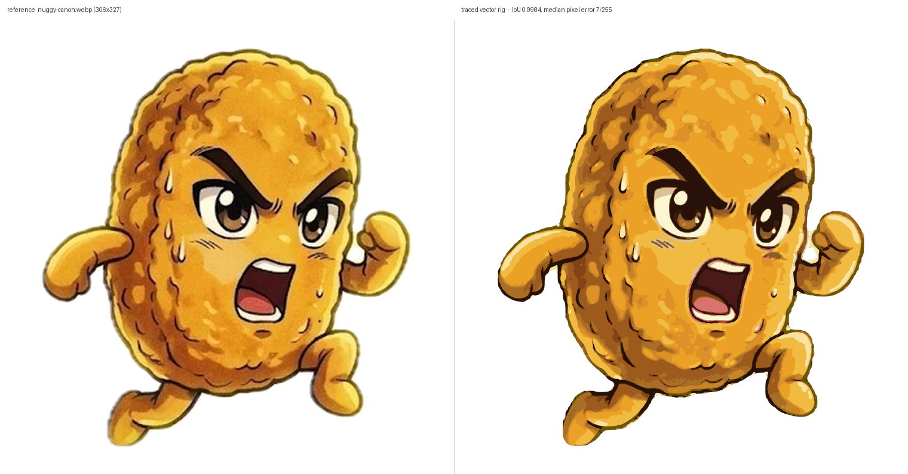
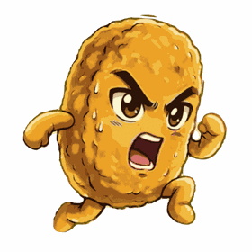
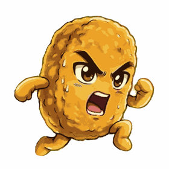
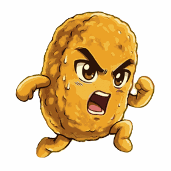

# Nuggy — 2D cutout rig for Blender

`nuggy.blend` is Nuggy rebuilt as flat vector artwork inside Blender, traced
from `../reference/nuggy-canon.webp`. Open it and look through the front view
(numpad 1).



Measured against the reference at its native 306×327: **silhouette IoU 0.9984**,
median pixel error **7/255**, and 4.6% of pixels off by more than 32/255. The
residual is almost entirely the airbrushed gradients in the original being
posterized into flat regions — which is what makes the art usable as geometry.

## Swapping and moving features

Nine groups are independent: `body`, `eye_L`, `eye_R`, `mouth`, `sweat`,
`arm_L`, `arm_R`, `leg_L`, `leg_R`.

**To move one**, grab its socket empty in the **Sockets** collection —
`SOCKET_mouth`, `SOCKET_eye_L`, and so on. Move, rotate or scale the socket and
the whole feature follows. Slide the eyes apart, drop the mouth, tilt the
raised fist.

**To hide one**, select `NUGGY_CTRL` (the sphere below his feet), press `N`, and
use Item → Custom Properties. Each slot has a 0/1 toggle. A hidden feature
reveals the skin fill beneath it rather than a hole.

**To replace one**, hide it and parent your own artwork to that socket.

`NUGGY_ROOT` is the parent of everything: rotate it on Y to lean him, scale it
to resize him as a unit.

Two honest limits. The eyes and mouth leave a faint ghost when hidden, because
some shading immediately around them traces as body rather than as the feature.
And the brow and upper lid are one connected black mass in this artwork, so each
eye slot owns both — there is no separate brow slot.

## Rendering

Orthographic camera, transparent film, flat emission materials, Standard view
transform. A render is a clean 2048² cutout with no background and no ground
shadow, and rendered colour equals the palette hex exactly — no lighting to set
up, same result in EEVEE or Cycles.

## How the artwork is produced

The art is *traced*, not drawn by hand. Three stages, all run under Blender's
own Python because it ships numpy:

```sh
BLENDER=/Applications/Blender.app/Contents/MacOS/Blender

$BLENDER -b -P trace/quantize.py     # reference  -> trace/out/labels.npy
$BLENDER -b -P trace/contours.py     # labels     -> trace/out/trace.json
$BLENDER -b -P nuggy_build.py        # trace.json -> nuggy.blend
```

`nuggy_build.py` only needs `trace.json`, which is committed, so a rebuild of
the .blend does not require re-tracing.

**Stage 1, `quantize.py`** assigns every pixel to one of sixteen named colours.
Three things make this harder than a nearest-colour match:

- The source is 306px wide, so ink strokes are one to three pixels and
  classifying at native size gives broken, jagged linework. Upsampling 4× first
  turns the anti-aliased edges into ramps and the class boundary lands on the
  sub-pixel position the artist drew. This was the single biggest quality win.
- The eye and mouth colours are near-duplicates of the body's dark shading, so
  each is fenced to the box where that feature actually lives. The dark olive
  `rim` is fenced to a band just inside the silhouette; unfenced it ate the brow
  tips, where ink fades into gold through the same olive range.
- The body is airbrushed, so posterizing speckles. A mode filter restricted to
  the gold tones cleans that up without eating the thin ink lines. Dark pixels
  the gold tones stole are then reclaimed to ink and morphologically closed, so
  outlines read as continuous strokes instead of dashes.

**Stage 2, `contours.py`** walks each colour mask's boundary as directed pixel
edges, keeping the filled side consistently on one hand. Loops chain out of
that automatically and holes arrive with the opposite winding, so they need no
separate detection — they become extra splines and the even-odd fill does the
rest. Loops are simplified (Douglas-Peucker) then rounded (Chaikin).

It also decides slot membership, by containment rather than by centre: a shape
joins a face slot only if it fits entirely inside that slot's box *and* its
layer is one a face can own. Limbs can't be assigned that way at all — a single
gold region runs unbroken from torso into arm — so every layer is first cut
along the body-core boundary (the silhouette morphologically opened) and the
two sides traced separately.

**Stage 3, `nuggy_build.py`** builds one filled 2D curve object per
(slot, layer), parented to that slot's socket, stacked on local Z by `ZORDER`.

## Checking a change

```sh
$BLENDER -b -P trace/build_check.py        # build from trace.json + report fidelity
$BLENDER -b nuggy.blend -P trace/verify.py # render the saved .blend and report
```

Both print silhouette IoU and pixel error against the reference, so tuning the
tracer is a measurement rather than a judgement call. The knobs worth touching
live at the top of `contours.py`: `BLUR_R` (mask smoothing — 0 measured best,
the 4× upsample already does the smoothing), `RDP_EPS` (simplification, trades
points against accuracy), `MIN_AREA_PX` / `MIN_AREA_INK` (speck removal; ink
keeps a much lower floor because the breading detail is tiny strokes).

Three things that cost real time and are worth not rediscovering:

- Layers are grown a quarter pixel so neighbours overlap and shared edges do not
  leave hairline gaps — but the growth is clipped to the silhouette, or it shows
  as a halo outside the character.
- Pieces that overlap must be separate curve objects. Merged into one, even-odd
  fill turns the overlap into a hole, which is what put gold bars across the
  first build and dark seams along every limb cut in a later one.
- Setting a custom property from Python does not tag the depsgraph, so the
  visibility drivers keep reading the old value. Call `ctrl.update_tag()`, which
  is what `--set` does. Dragging the slider in the UI is fine.

## Animation

`nuggy_animate.py` adds keyframes to the rig and writes `nuggy-animated.blend`.
Three clips ship with it, on one timeline, each with a marker:

| clip | frames | length | what it does |
|---|---|---|---|
| `idle` | 1–60 | 2.5s | breathing, arm drift, one blink |
| `run` | 71–94 | 1.0s | leg and arm cycle, two-beat body bob, forward lean |
| `shout` | 101–130 | 1.2s | battle cry: anticipate, hit, settle |

  

```sh
$BLENDER -b -P nuggy_animate.py                                   # all clips, save
$BLENDER -b -P nuggy_animate.py -- --clip run --render out/r_ --res 512
```

To play one in the UI, open `nuggy-animated.blend` and set the frame range to
that clip's numbers (the fields either side of the play button), then press
space. Each clip loops seamlessly on its own range.

This is **cutout animation**: nothing is redrawn between frames, the sockets are
just moved, exactly like posing a paper puppet under a camera. That is why the
rig suits it — the nine groups were already separate objects on their own
transforms, and the limb pivots sit at the shoulders and hips so a rotation
swings the limb rather than pivoting it mid-arm.

Keyframes are on socket `location` / `rotation_euler` / `scale`, plus
`NUGGY_ROOT` for whole-body bob, lean and squash-and-stretch. Note that scaling
the root uses **X for horizontal and Y for vertical** — the root is rotated
upright, so its local Y is world Z. Leave root scale Z alone or the layer
spacing changes.

### The eyelids

The reference has both eyes open, so there is no closed drawing to lift for a
blink. `nuggy_build.py` generates one: a copy of each eye's own sclera outline,
in skin gold, with a second dark copy behind it nudged down a few pixels to
leave a lash line. Its origin sits on its top edge, so `scale.y` 0 is open and
1 is shut, and it is sized to the sclera rather than the whole eye group so the
brow stays put during a blink.

The lids rest at `scale.y = 0`, which is why `key()` in `nuggy_animate.py` has a
`scale_abs` option — a relative scale would multiply by zero and never move
them.

This is the roughest part of the animation. The lid closes with the eye's real
curve, but the traced ink outline around the eye stays visible behind it, so a
held-closed pose looks better than it should at rest. Tune `grown` and `lash` in
`add_eyelid()`.

### Output formats

Renders come out as a transparent PNG sequence, which is the master. From there:

- **WebM / VP9** keeps the alpha — the right choice for laying him over a page.
- **MP4 / H.264** is smaller and universally supported but has no transparency.
- **GIF** is simplest and by far the largest; the previews above are GIFs.
- **Sprite sheet** — frames tiled into one PNG, stepped with CSS
  `animation-timing-function: steps()`. Usually the cheapest option for a
  storefront loop, and the one I would reach for here.

Blender writes WebM and MP4 directly (Output properties → File Format →
FFmpeg Video). Say the word and I will wire up whichever you want.


## Towards 3D

The layer split is the useful part: each `ZORDER` layer is already a separate
closed 2D curve, so extruding per layer with a small offset gives a relief
version straight away, and the per-slot cut means arms and legs are already
their own objects rather than welded to the torso. The animation carries over
too — it is all socket transforms, so it keeps working whatever the sockets are
driving.

## `legacy/`

`legacy/nuggy_parametric.py` is the earlier version: Nuggy drawn from scratch
with generated geometry (a sine-sum silhouette, tapered noodle limbs, a
parametric eye/mouth aperture) and a full multi-variant expression set — four
brows, five mouths, three arm poses. It builds a recognisable but much looser
Nuggy. It is kept because those alternate expressions are real work and the
trace has no equivalent yet; it is not part of the current build.
