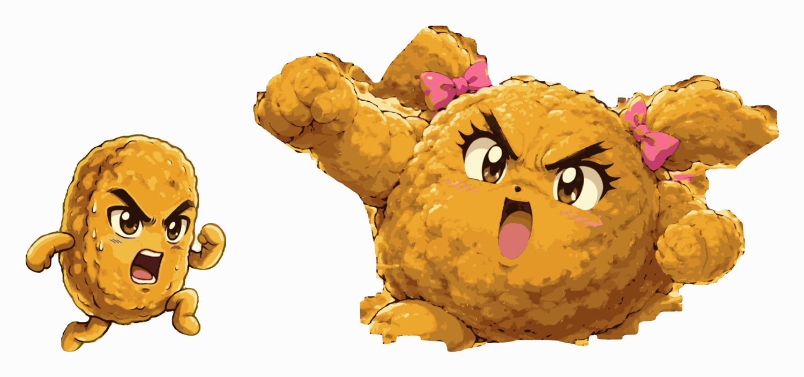
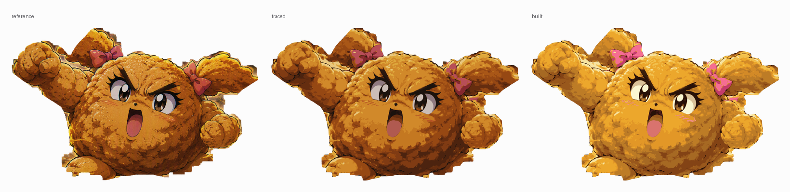

# Five-piece cutout rigs for Blender

Each character is traced from their reference art and rebuilt inside Blender as
flat vector curves on a socket rig. Open a `.blend` and look through the front
view (numpad 1).

| | character | reference | size | fidelity |
|---|---|---|---|---|
| `nuggy.blend` | Nuggy, the leader | clean cutout, 306x327 | 3.50 units tall | IoU 0.9984, median error 7/255 |
| `nuggette.blend` | Miss Nuggette, the tank | scene illustration, 1536x1024 | 5.25 units tall | IoU 0.9833, median error 7/255 |
| `nuggette-flat.blend` | the same trace, ungraded | | | the build the numbers above are measured on |

They share a world scale, so 5.25 against 3.50 is the 1.5x height difference
you get standing them next to each other.



Everything per-character lives in `characters.py`: colour seeds, feature boxes,
limb cuts, speck floors, pixel-to-world scale. The four pipeline stages are
shared and take `--char`.

## Swapping and moving features

Nuggy has nine independent groups, Miss Nuggette ten:

| | groups |
|---|---|
| Nuggy | `body` `eye_L` `eye_R` `mouth` `sweat` `arm_L` `arm_R` `leg_L` `leg_R` |
| Miss Nuggette | `body` `eye_L` `eye_R` `mouth` `pig_L` `pig_R` `arm_L` `arm_R` `leg_L` `leg_R` |

**To move one**, grab its socket empty in the **Sockets** collection, such as
`SOCKET_mouth` or `SOCKET_pig_R`. Move, rotate or scale the socket and the whole
feature follows. Slide the eyes apart, drop the mouth, swing a pigtail.

**To hide one**, select the CTRL empty below the character's feet
(`NUGGY_CTRL`, `NUGGETTE_CTRL`), press `N`, and use Item -> Custom Properties.
Each group has a 0/1 toggle. A hidden feature reveals the skin fill beneath it
rather than a hole.

**To replace one**, hide it and parent your own artwork to that socket.

`<NAME>_ROOT` is the parent of everything: rotate it on Y to lean the character,
scale it to resize them as a unit.

Two honest limits. The eyes and mouth leave a faint ghost when hidden, because
some shading immediately around them traces as body rather than as the feature.
And brow and upper lid are one connected black mass in both drawings, so each
eye group owns both. There is no separate brow group.

## Rendering

Orthographic camera, transparent film, flat emission materials, Standard view
transform. A render is a clean cutout with no background and no ground shadow,
and rendered colour equals the palette hex exactly. Nothing to light, same
result in EEVEE or Cycles.

## The pipeline

```sh
BLENDER=/Applications/Blender.app/Contents/MacOS/Blender

$BLENDER -b -P trace/matte.py    -- --char nuggette  # scene art -> RGBA cutout
$BLENDER -b -P trace/quantize.py -- --char nuggette  # cutout    -> labels.npy
$BLENDER -b -P trace/contours.py -- --char nuggette  # labels    -> trace.json
$BLENDER -b -P build.py          -- --char nuggette  # trace     -> .blend
```

All of it runs under Blender's own Python, because that is the one on this
machine with numpy. `build.py` only needs `trace.json`, which is committed, so
rebuilding a `.blend` does not mean re-tracing.

### Stage 0, `matte.py`: cut the character out of a scene

Nuggy skips this. His art arrived as a clean cutout, so the silhouette is just
the alpha channel.

Miss Nuggette's reference is a painted VHS-style screengrab: fryer, oil swirls,
Japanese titling, film grain, and a ground in exactly her golden brown. Colour
alone cannot separate her from it. What works is three things together.

A hand-drawn **fence** polygon, loose everywhere except along the bottom where
she meets the oil. It only has to beat the scenery colour cannot, so it is about
fifty points, not a traced silhouette.

A tight **core** mask flooded from seed points inside her, which finds the lit
breading and stops at the ink outline.

**Geodesic growth** of that core through a looser mask, capped at a fixed number
of steps. This reaches her shadowed parts, the right pigtail and the underside
of the body, without being able to run off into the scene, because growth has to
start somewhere already known to be her.

Then an opening removes the thin glowing tendrils that growth picks up along the
rim light, and the largest component is kept.

The crop is frozen in the spec (`crop=`, `out=`). Deriving it from the measured
silhouette instead means every tweak to the fence shifts the coordinate system,
and with it every feature box measured in it. The script prints the rect it
derived so it can be pasted back.

### Stage 1, `quantize.py`: posterize into named colour layers

Every pixel is assigned to one of the character's colour seeds. Three things
stop a naive nearest-colour match from working.

Ink strokes are a few pixels wide, so classifying at native size gives broken,
jagged linework. Upsampling 4x first turns the anti-aliased edges into ramps and
the class boundary lands on the sub-pixel position the artist drew. This was the
single biggest quality win on Nuggy.

Eye, mouth and bow colours are near-duplicates of the body's dark shading, so
each is fenced to the box where that feature lives. Unfenced, Nuggy's dark olive
rim tone ate his brow tips, where ink fades into gold through the same range.

The breading is airbrushed, so posterizing speckles. A mode filter restricted to
the breading tones cleans that up without eating the thin ink lines. Dark pixels
the breading tones stole are then reclaimed to ink and morphologically closed,
so outlines read as continuous strokes instead of dashes.

`ink_lum`, the level below which a breading pixel is really linework, is
per-character for a reason. Miss Nuggette's whole palette sits darker than
Nuggy's, and at his 0.30 her deepest shadow tone turns to ink.

### Stage 2, `contours.py`: masks to polygons, and slots

Each colour mask's boundary is walked as directed pixel edges with the filled
side kept on one hand. Loops chain out of that automatically and holes arrive
with the opposite winding, so they need no separate detection: they become extra
splines and the even-odd fill does the rest. Loops are simplified with
Douglas-Peucker, then rounded with Chaikin.

Face slots are assigned by containment rather than by centre: a shape joins a
slot only if it fits entirely inside that slot's box **and** its layer is one a
face can own.

Limbs cannot be assigned that way, because a single breading region runs
unbroken from torso into arm. There are two ways to cut it:

- **Morphological**, which Nuggy uses. Open the silhouette, call whatever that
  removes a limb, hand each piece to the nearest joint. Free to set up, and it
  works on a figure whose limbs are visibly thinner than its body.
- **Explicit**, which Miss Nuggette uses. Draw the cut as a polygon per limb.
  She is one huge round mass with limbs as thick as a section of torso, so no
  radius separates them: opening either leaves the arms welded on or shaves
  every popcorn bump off the perimeter. Where the cut goes is a rigging decision
  anyway, the same one you make cutting a paper puppet apart, so it is better
  made by hand.

### Stage 3, `build.py`: polygons to a rigged .blend

One filled 2D curve object per (slot, layer, region), parented to that slot's
socket, stacked on local Z by the character's `zorder`.

## Checking a change

```sh
$BLENDER -b nuggette.blend -P trace/verify.py -- --char nuggette
$BLENDER -b -P build.py -P trace/verify.py -- --char nuggy --no-save
```

The second form builds and measures in one session without touching the saved
file. Both print silhouette IoU and pixel error against the reference, so tuning
the tracer is a measurement rather than a judgement call.

Knobs worth touching are at the bottom of each character in `characters.py`:
`blur_r` (mask smoothing, 0 measured best on both, the 4x upsample already does
it), `rdp_eps` (simplification, trades points against accuracy), `min_area` and
`min_area_ink` (speck removal; ink keeps a much lower floor because breading
detail is tiny strokes).

A sweep on Miss Nuggette is worth knowing about: `min_area` from 2 to 12 and
`rdp_eps` from 1.0 to 2.6 changed mean error by less than 0.2/255 while cutting
her from 5354 shapes to 1900. Her error floor is set by film grain in the
source, not by the polygons, so the cheap settings are the right ones. Do not
assume the same holds for the next character; measure it.

Three things that cost real time and are worth not rediscovering:

- Layers are grown a quarter pixel so neighbours overlap and shared edges do not
  leave hairline gaps, but the growth is clipped to the silhouette, or it shows
  as a halo outside the character.
- Pieces that overlap must be separate curve objects. Merged into one, even-odd
  fill turns the overlap into a hole, which is what put gold bars across the
  first build and dark seams along every limb cut in a later one.
- Setting a custom property from Python does not tag the depsgraph, so the
  visibility drivers keep reading the old value. Call `ctrl.update_tag()`, which
  is what `--set` does. Dragging the slider in the UI is fine.

## Miss Nuggette's palette

Her reference is graded like a 1995 VHS tape: every tone sits a stop darker and
a shade greyer than the crew's house palette. That grade belongs to the art
direction, not to her, so `nuggette.blend` puts it back. The tracer still
matches on the colours measured off the reference; the swap happens at build
time, from `NUGGETTE_PALETTE` in `characters.py`.



The breading is not eyeballed. Her nine tones, ordered dark to light, are
resampled onto Nuggy's eight, so she lands on exactly his ramp rather than near
it. Her face and ink take his values outright. The bows are the one entry that
is a choice rather than a transfer: the reference paints them a dusty rose, and
the crew reads her as bubblegum.

`nuggette-flat.blend` is the same trace in the measured colours, VHS grade and
all. It exists so fidelity stays measurable: comparing the regraded build
against the reference would measure the regrade, not the trace.

```sh
$BLENDER -b -P build.py -- --profile nuggette-flat
```

## Profiles

`profiles.py` takes a traced character and warps it: the torso through a
free-form function, each slot through a transform about its own pivot, the
palette through a recolour. The identity profile gives geometry identical to
building the character directly, which is what keeps it honest.

This started as the way to make the whole crew out of Nuggy's one trace. It is
not that any more, because tracing each character from their own art is far
better, so what it is for now is pose variants and palette work.

One profile ships: `nuggette-flat`, described above.

## Animation

`nuggy_animate.py` adds keyframes to Nuggy's rig and writes
`nuggy-animated.blend`. Three clips ship with it, on one timeline, each with a
marker:

| clip | frames | length | what it does |
|---|---|---|---|
| `idle` | 1-60 | 2.5s | breathing, arm drift, one blink |
| `run` | 71-94 | 1.0s | leg and arm cycle, two-beat body bob, forward lean |
| `shout` | 101-130 | 1.2s | battle cry: anticipate, hit, settle |

  

```sh
$BLENDER -b -P nuggy_animate.py
$BLENDER -b -P nuggy_animate.py -- --clip run --render out/r_ --res 512
```

To play one in the UI, open `nuggy-animated.blend` and set the frame range to
that clip's numbers, then press space. Each clip loops seamlessly on its own
range.

This is **cutout animation**: nothing is redrawn between frames, the sockets are
just moved, exactly like posing a paper puppet under a camera. That is why the
rig suits it. The groups were already separate objects on their own transforms,
and the limb pivots sit at the joints, so a rotation swings the limb rather than
pivoting it mid-arm.

Keyframes are on socket `location` / `rotation_euler` / `scale`, plus
`NUGGY_ROOT` for whole-body bob, lean and squash-and-stretch. Scaling the root
uses **X for horizontal and Y for vertical**, because the root is rotated
upright and its local Y is world Z. Leave root scale Z alone or the layer
spacing changes.

The clips are Nuggy's, and the script is still written against his slot names.
Miss Nuggette's rig takes keyframes the same way, but her clips have not been
written: she has pigtails to swing and no sweat drops to shake.

### The eyelids

Both references have the eyes open, so there is no closed drawing to lift for a
blink. `build.py` generates one: a copy of each eye's own sclera outline, in
skin colour, with a second dark copy behind it nudged down a few pixels to leave
a lash line. Its origin sits on its top edge, so `scale.y` 0 is open and 1 is
shut, and it is sized to the sclera rather than the whole eye group so the brow
stays put.

The lids rest at `scale.y = 0`, which is why `key()` in `nuggy_animate.py` has a
`scale_abs` option. A relative scale would multiply by zero and never move them.

This is the roughest part of the animation. The lid closes with the eye's real
curve, but the traced ink outline around the eye stays visible behind it, so a
held-closed pose looks worse than it does in motion. Tune `grown` and `lash` in
`add_eyelid()`.

### Output formats

Renders come out as a transparent PNG sequence, which is the master. From there:

- **WebM / VP9** keeps the alpha, the right choice for laying a character over a
  page.
- **MP4 / H.264** is smaller and universally supported but has no transparency.
- **GIF** is simplest and by far the largest; the previews above are GIFs.
- **Sprite sheet**, frames tiled into one PNG and stepped with CSS
  `animation-timing-function: steps()`. Usually the cheapest option for a
  storefront loop, and the one I would reach for here.

Blender writes WebM and MP4 directly (Output properties -> File Format ->
FFmpeg Video). Say the word and I will wire up whichever you want.

## Towards 3D

The layer split is the useful part. Each `zorder` layer is already a separate
closed 2D curve, so extruding per layer with a small offset gives a relief
version straight away, and the per-slot cut means arms and legs are already
their own objects rather than welded to the torso. The animation carries over
too, since it is all socket transforms.

## `legacy/`

`legacy/nuggy_parametric.py` is the earlier version: Nuggy drawn from scratch
with generated geometry (a sine-sum silhouette, tapered noodle limbs, a
parametric eye and mouth aperture) and a full multi-variant expression set, four
brows, five mouths, three arm poses. It builds a recognisable but much looser
Nuggy. It is kept because those alternate expressions are real work and the
trace has no equivalent yet. It is not part of the current build.
